# FlowVerse Engineering Intelligence

[English](README.md)

## 简介

FlowVerse 是一个 AI 原生工程平台，用于连接快速发布、运营和持续演进复杂产品所需的各种视角。

经过配置和授权的领域知识会形成相互连接、由来源支撑的上下文，供工程师、工具、LLM 和 Agent 共同使用。LLM-command 设计模式基于该上下文公开边界明确的语义操作，使模型和 Agent 能够通过产品本身使用的同一组平台能力自然集成，而不是依赖独立的 AI 层。工程团队可以通过领域模块扩展这一共享基础，并定义自身数据、关系、验证和呈现方式的集成规则。配置完成后，平台可在产品战略、需求、交付工作、源代码、模型、PLM 记录、数字孪生、资产注册表、工业自动化系统、已部署软件、集成关系和运行数据流等生命周期领域之间提供统一、可导航的产品视图。

借助授权领域之间相互连接的知识，通过 FlowVerse 工作的 AI Agent 可以回答问题并生成有依据的解决方案建议。FlowVerse 随后可通过受治理的领域命令，将这些建议及其获批结果呈现并连接到各领域的相关记录，为团队提供从上下文、分析到决策和结果的可追溯路径。注册相应领域后，同一模式还可以把建议连接到需求变更、PLM 与模型修订、数字孪生场景、工业自动化配置、资产上下文和运行证据，而不仅限于软件变更。

## 智能工厂演示

### 背景

内置演示描述了一家使用自建 Kubernetes 平台运营 CNC 机床、机器人和装配线的制造企业。工业设备通过 OPC UA 和 MQTT 将遥测数据发布到 Kafka 事件骨干；平台服务再将这些信号转化为机器状态、异常告警、故障预测、维护工单、操作员通知和生产影响记录。外部 CMMS、ERP/MES、供应商、设备制造商和通知系统共同构成完整的运营环境。

同一产品由两个独立管理的视角表示。System Architecture 领域描述服务、模块、接口、基础设施和运行数据流；Agile Delivery 领域描述由 Epic、Story、Task、Bug 和 Spike 组成的五级交付组合。显式跨领域链接把交付意图连接到其覆盖或实现的系统和模块，而不会复制任何一方的源记录。所有组织、团队、Issue Key、端点和运营内容均为虚构数据。

### 使用已发布的演示

1. 在发布仓库中获取最新的 `releases/flowverse-vscode-vX.Y.Z.vsix`，并通过 **Extensions: Install from VSIX...** 安装。
2. 在 VS Code 中将 `resources/examples/` 作为文件夹打开。FlowVerse 会发现其中的 `unified-worldview.instance.json`，以及它引用的架构、交付和跨领域记录。
3. 打开活动栏中的 FlowVerse 视图，或通过命令面板运行以下命令之一：

   - **FlowVerse: Open System Architecture Canvas**：查看运营技术与软件全景；
   - **FlowVerse: Open Agile Delivery Canvas**：查看交付层级、依赖、阻塞项、证据和就绪度；
   - **FlowVerse: Open Unified Worldview Canvas**：查看相互连接的跨领域视图。

4. 选择卡片、关系或数据流步骤，以检查其来源支撑的详细信息。如果 Copilot Chat 可用，可使用 `@flowverse` 导航相同上下文、回答问题或聚焦指定实体。

开发扩展时，请打开本源码仓库，在 Run and Debug 中选择 **Run FlowVerse with Smart Factory Example**，然后按 `F5`。Extension Development Host 会直接打开同一数据集。

完整的系统故事、服务职责、运行流程、交付模型和跨领域可追溯性，请参阅[智能工厂运营示例](docs/smart-factory-operations-example-zh_CN.md)。

## 来源支撑的架构

FlowVerse 可以把源材料转化为结构化架构知识，并立即呈现结果。画布并不是一张孤立的 AI 生成图片：详细信息工作台会在所选系统旁保留来源、采集方式、置信度、评审状态、证据引用和所有权。`@flowverse` Agent 可以打开相关视图，同时保持资源管理器、画布、详细信息和聊天之间的同步。

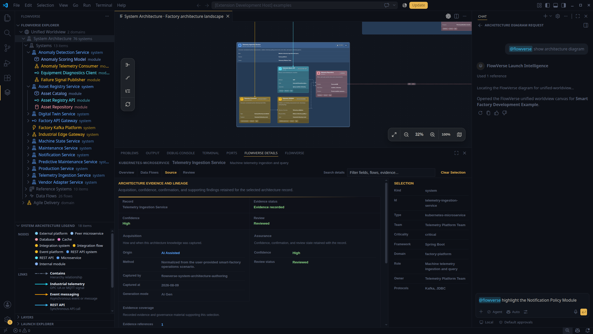

*AI 辅助的架构采集仍然可追溯。所选 Telemetry Ingestion Service 会展示其证据和沿袭信息，同时生成的架构仍可在画布中导航。*

### 相互连接的架构全景

System Architecture 画布提供系统、内部模块、外部平台、API、事件通道、数据库及其关系的组合级视图。由渲染器管理的卡片和边规则保持模型可读；资源管理器和动态图例则提供稳定导航与视觉含义。下方详细信息工作台使用同一组已加载记录汇总范围和连接情况。

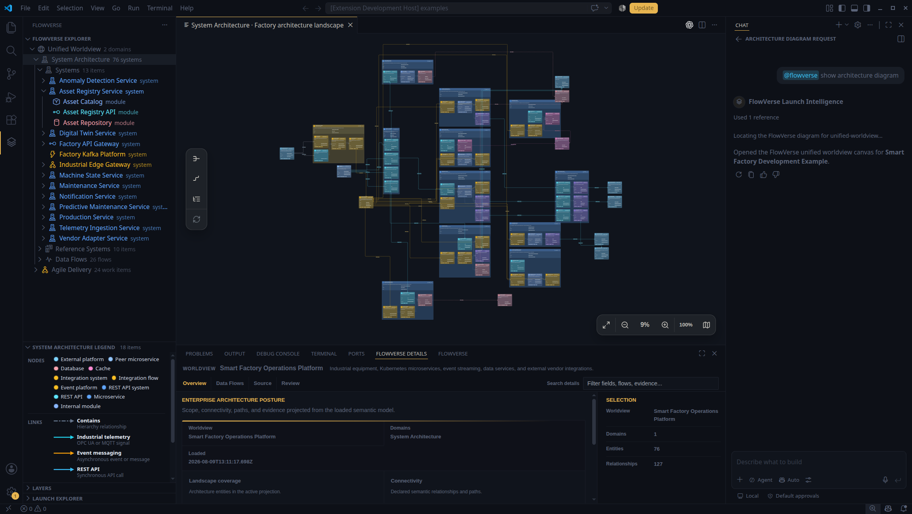

*完整的智能工厂全景在一个架构视图中连接工业设备、Kubernetes 服务、事件流、运营数据和外部供应商。*

## AI 引导的导航

Copilot 原生的 `@flowverse` 参与者使用与资源管理器和 UI 相同的画布命令。用户可以请求指定模块、服务、关系或数据流；FlowVerse 会解析由来源支撑的实体，将其高亮，在受控缩放级别下聚焦视口，并打开详细信息。Agent 不会创建平行图表，也不会生成架构的第二份副本。

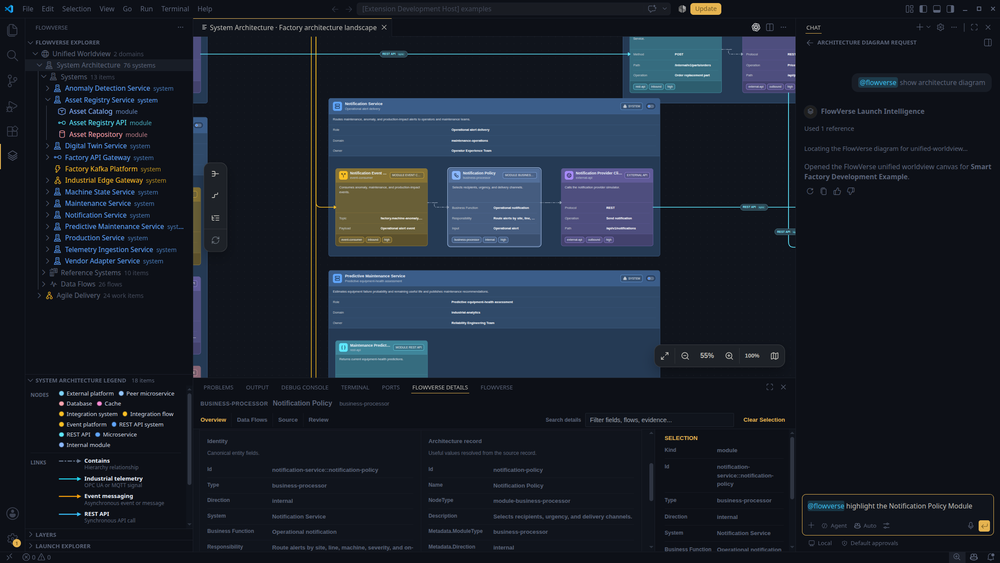

*自然语言导航会定位到所属服务中的 Notification Policy 模块，并展示该模块由来源支撑的架构详细信息。*

## 运行数据流

当团队能够检查工作如何实际流经架构时，架构才真正有用。Data Flows 标签页汇总当前范围内所有已声明路径，包括流类型、所有者、参与实体、关系覆盖和有序步骤数。该登记表支持排序和列宽调整，因此既适用于组合评审，也适用于聚焦调查。

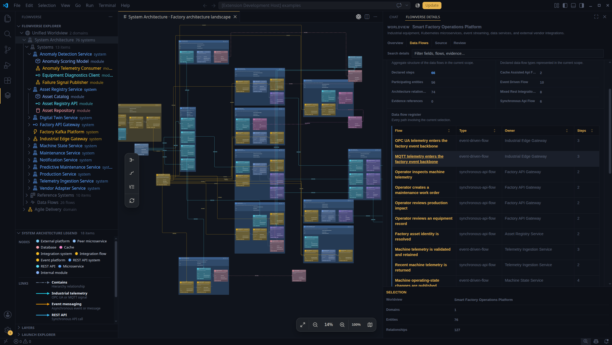

*架构级数据流登记表把复杂拓扑转化为遥测、维护、API 和事件驱动路径的运行索引。*

选择一个数据流会高亮其完整路径。选择单个步骤会把画布范围缩小到该执行步骤的确切来源、目标和关系，同时淡化无关元素，并在详细信息表中保留有序路径。

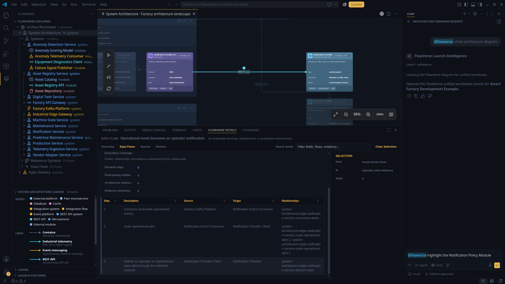

*步骤级聚焦把有序的业务或技术流程连接到实现它的精确架构交互。*

## 工程上下文中的交付

Agile Delivery 画布将 Epic、Story、Task、Bug 和 Spike 呈现为交付层级，而不是平面的 Issue 列表。自上而下的实线关系表达父子结构；带颜色的虚线关系保留依赖、阻塞、验证、实现等交付语义，同时不会破坏层级。资源管理器和图例会自动切换到当前交付领域。

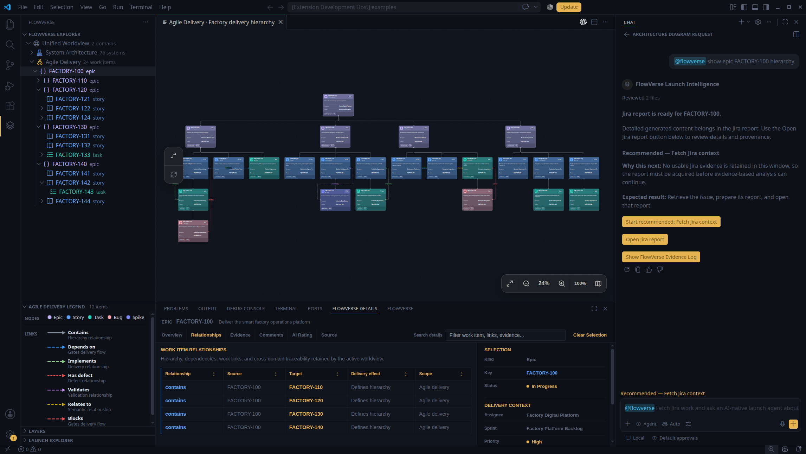

*交付画布让多级范围分解和工作项关系清晰可见，同时保留原始 Jira 风格记录。*

### 结构化工作项报告

选择一个工作项会打开结构化报告，而不是通用属性堆叠。Overview、Relationships、Evidence、Comments、AI Rating 和 Source 分别呈现交付标识、所有权、规划上下文、需求、验收与完成证据、讨论、评估和沿袭。产品、工程、架构、质量和运营团队可以在不更改源 Issue 的前提下使用同一评审界面。

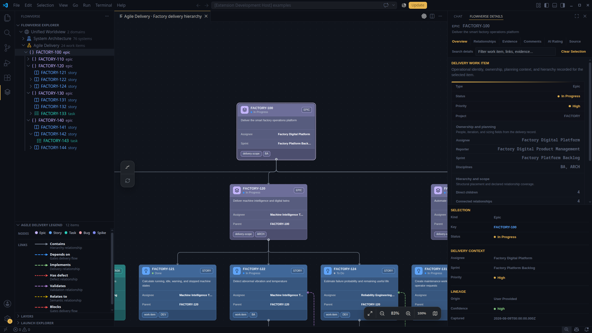

*报告把运行交付上下文放在层级旁，使评审者既能理解所选工作项，也能了解它在整体计划中的位置。*

### 可见的依赖与阻塞项

逻辑交付关系与父子层级独立呈现。选择一条 `blocks` 边会高亮阻塞项和被阻塞项，淡化无关工作，并在详细信息面板中解释关系方向和交付影响。团队可以直接在上下文中查看门控缺陷，而不必从关联 Issue 字段中重新拼接关系。

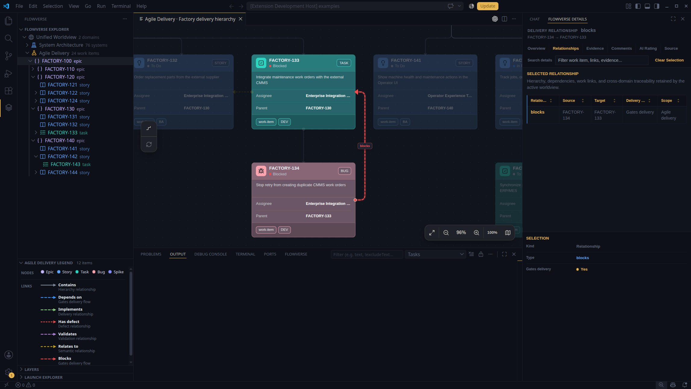

*所选 Bug 阻塞 CMMS 集成 Task；画布和详细信息视图共同展示两个端点、方向和门控影响。*

## 相互连接的产品上下文

产品知识、决策和结果分布在独立管理的领域中，每个领域都有自己的记录、工具和权威来源。FlowVerse 在保留领域所有权的同时，把这些视角连接为一个由来源支撑的 Worldview。内置开发示例通过连接智能工厂 System Architecture 领域和 Agile Delivery 领域，演示了这一可扩展模型。

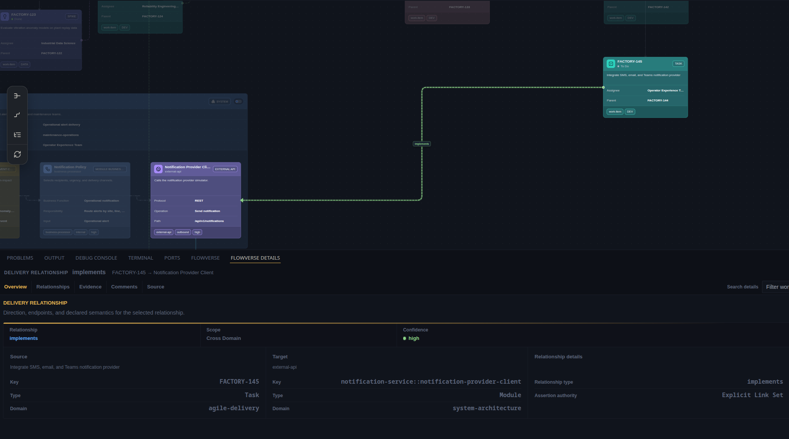

*内置示例在不复制任何记录的前提下，把交付意图连接到架构实现。同一模型可以连接注册领域提供的任何可寻址元素。*

团队可以从 Epic 或 Task 移动到其实现的服务或模块，追踪受影响的数据流，检查证据，并追溯相互连接的决策和结果。工程和交付负责人可以跨领域评审完整的影响、依赖、预测和结果链。团队还可以把同一模式扩展到仿真领域，将假设和输入连接到仿真结果、被评估的产品元素，以及这些结果所支撑的决策。

FlowVerse 将共享交互式画布、领域专属可视化、经过验证的源记录、支持 Jira 的交付智能，以及 Copilot 原生 `@flowverse` Agent 组合在一起。探索、选择、聚焦、检查和追踪这一套交互模型同时适用于领域画布和组合 Worldview。

## 可解释的交付就绪度

当工作项尚无评估时，AI Rating 标签页会说明将评估哪些由来源支撑的因素，并提供一个克制的 **Rate work item** 操作。评估使用当前交付配置和工作项证据，不会暗中修改 Jira 风格的源记录。

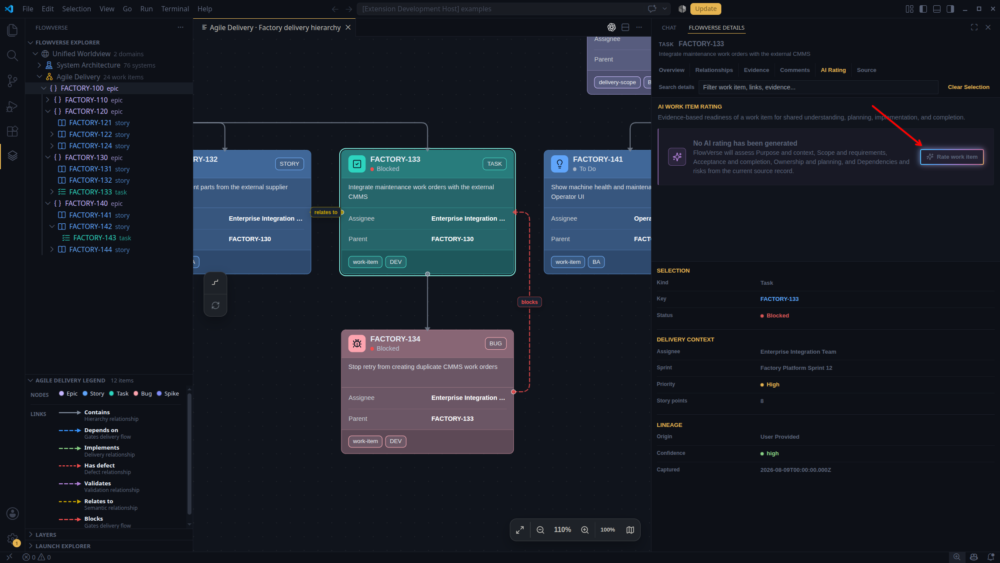

*评分操作与所选 Task、阻塞项、所有权、优先级和沿袭信息共同处于当前上下文中。*

评估结果会把总体就绪度评分连接到各组成因素、阈值、权重和依据。颜色分段区分 Ready、Mostly ready、Needs refinement 和 At risk。优先建议会把最弱因素转化为具体后续行动；除非源数据中显式包含评估，否则生成的评估仅保留在当前会话中。

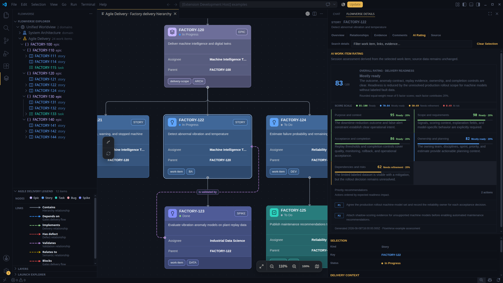

*示例中 `FACTORY-122` 的得分为 83/100：目的、范围、验收、所有权和依赖/风险就绪度均可独立解释，而不是隐藏在一个 AI 分数背后。*

## 文档

README 提供产品简介和可视化导览。以下专题指南分别介绍平台机制、扩展点、AI 工作流和贡献者操作。

| 指南 | 视角 | 适用对象 |
| --- | --- | --- |
| [平台模型与画布](docs/platform-and-canvas-zh_CN.md) | 产品模型、画布类型、共享交互、详细信息和来源优先级 | 产品团队、架构师和交付团队 |
| [领域集成](docs/domain-integration-zh_CN.md) | 领域包、连接器、验证、资源和数据解析 | 领域工程师和平台工程师 |
| [AI 原生工作流](docs/ai-native-workflows-zh_CN.md) | LLM-command 集成、Agent 导航、分析和受治理操作 | Agent 构建者和 FlowVerse 用户 |
| [开发与发布](docs/development-and-releases-zh_CN.md) | 环境配置、验证、打包、CI、发布和仓库结构 | 贡献者和维护者 |

### 补充参考

- [智能工厂运营示例](docs/smart-factory-operations-example-zh_CN.md) - 连接交付工作、架构与运行流程的端到端示例。
- [AI Agent 用户指南](docs/AI_AGENT_USER_GUIDE-zh_CN.md) - 配置、命令、审批、能力验证和故障排查。
- [图表操作框架](docs/architecture/diagram-action-framework-zh_CN.md) - 用于确定性画布导航和操作的共享命令契约。
- [架构设计](docs/architecture-design-zh_CN.html) - 交互式技术架构参考。
