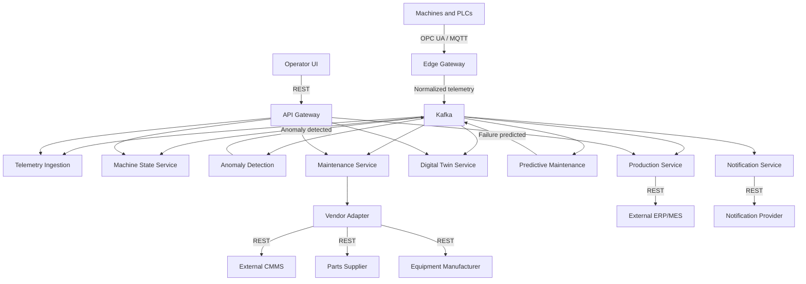

# 智能工厂运营示例

[English](smart-factory-operations-example.md)

## 工厂

该示例描述了一家使用自建平台运营 CNC 机床、机器人和装配线设备的制造企业。平台以 Kubernetes 微服务运行，并把工厂边缘的运营技术与企业系统和供应商系统连接起来。

传感器持续发布温度、振动、压力、能耗和生产周期测量值。平台把这些信号转化为机器状态、异常告警、故障预测、维护工单、备件订单、操作员通知和生产影响记录。

本仓库中的所有公司、团队、Issue Key、端点和测量数据均为虚构的开发数据。

## 架构故事



Edge Gateway 管理工业协议边界。它接收 OPC UA 数值变化和 MQTT 消息，标准化单位、时间戳、质量和资产标识，然后把标准遥测信封发布到 Kafka。下游服务通过事件骨干使用数据，而不是直接连接设备。

## 自建服务

| 服务 | 职责 | 主要接口 |
| --- | --- | --- |
| API Gateway | Operator UI 和外部客户端的入口 | REST |
| Asset Registry | 存储工厂、产线、机器和传感器 | REST、JDBC |
| Telemetry Ingestion | 验证并存储机器测量值 | Kafka、REST、JDBC |
| Machine State Service | 计算 Running、Idle、Warning 和 Stopped 状态 | Kafka、REST、Cache |
| Anomaly Detection | 检测异常振动、温度和压力 | Kafka、REST |
| Predictive Maintenance | 估算故障概率和剩余使用寿命 | Kafka、REST |
| Maintenance Service | 创建并跟踪维护工单 | Kafka、REST |
| Production Service | 跟踪生产任务、产出、停机和不合格品 | Kafka、REST、JDBC |
| Vendor Adapter | 隔离 CMMS、供应商和制造商 API | REST |
| Notification Service | 向操作员和维护团队发送告警 | Kafka、REST |
| Digital Twin Service | 维护最新机器状态 | Kafka、REST、Cache |

Kafka 被建模为共享事件平台。示例还将工厂运营数据库、遥测数据库和机器状态 Cache 作为显式基础设施边界。

## 外部系统

- **ERP/MES 模拟器**提供生产订单并接收停机报告。
- **CMMS 模拟器**接收维护工单。
- **备件供应商**返回价格、可用性、交付日期和订单确认。
- **设备制造商**提供型号专属诊断信息。
- **通知提供方**模拟短信、邮件和 Teams 告警。

## 运行生命周期

1. 机器或 PLC 发布 OPC UA 数值变化，或者传感器发布 MQTT 遥测数据。
2. Edge Gateway 标准化信号并将其发布到 Kafka。
3. Telemetry Ingestion 持久化测量值，同时 Machine State 和 Digital Twin 更新当前运营视图。
4. Anomaly Detection 评估异常信号。Predictive Maintenance 组合异常、状态和诊断信息以估算故障风险。
5. 故障预测触发 Maintenance Service 创建工单。
6. Vendor Adapter 在 CMMS 中登记工单，并在需要时获取备件或制造商诊断信息。
7. Notification Service 通知操作员，Production Service 记录预期或实际停机影响。

架构数据将这些路径记录为有序数据流。每个步骤都会解析到一个交互或内部模块流，因此画布可以选择单个步骤或完整运行路径，而无需制造链接。

## Agile 工作方式

虚构的 Factory Digital Platform Programme 使用 Jira 风格交付记录。产品、工厂运营、工业连接、平台、数据科学、可靠性、安全和集成团队共享同一 Backlog，同时保持清晰所有权。

示例包含 66 个工作项，其中有 27 个执行 Task，分布在三个独立的 Programme Tree 中，最多五个层级：

- `FACTORY-100` 交付核心运营平台，包括边缘遥测、机器智能、维护自动化，以及操作员/生产工作流。
- `FACTORY-200` 将受治理的资产身份和可回放数字孪生扩展到多个工厂。
- `FACTORY-300` 强化服务可靠性并治理生产发布就绪度。
- Story 和 Task 交付协议接入、Kafka 契约、异常模型、资产同步、Twin Projection、CMMS 集成、告警关联和发布控制。
- Bug 记录可观察缺陷，例如重复工单。
- Spike 记录在交付决策前有边界的回放与发布调查。

工作项在适用时包含由来源支撑的目的、需求、验收证据、完成条件、风险、待决问题、所有权、估算、关系、评论和来源信息。`FACTORY-122` 包含完整的就绪度评估与讨论历史示例，用于测试 Comments 和 AI Rating 视图。

交付层级控制 Agile Delivery 画布中的位置。依赖、阻塞、验证、缺陷、实现和相关工作链接仍为语义边，不会改变父子层级。

## 从交付到架构的可追溯性

跨领域 Link Set 把交付记录连接到其影响的精确架构边界。例如：

| 交付记录 | 关系 | 架构目标 |
| --- | --- | --- |
| `FACTORY-110` | scopes | Industrial Edge Gateway |
| `FACTORY-111` | implements | Edge Gateway / Telemetry Normalizer |
| `FACTORY-115` | implements | Kafka event platform |
| `FACTORY-122` | implements | Anomaly Detection / Anomaly Model |
| `FACTORY-124` | implements | Predictive Maintenance / Remaining-life Estimator |
| `FACTORY-133` | implements | Vendor Adapter / CMMS Client |
| `FACTORY-134` | required by | Maintenance Service / CMMS Adapter Client |
| `FACTORY-142` | implements | Production Service / Production-impact Calculator |
| `FACTORY-145` | implements | Notification Service / Provider Client |
| `FACTORY-211` | implements | Asset Registry / Asset Catalog |
| `FACTORY-221` | implements | Digital Twin Service / Twin Projector |
| `FACTORY-222` | implements | Digital Twin Service / Twin Cache |
| `FACTORY-311` | implements | Notification Service / Event Consumer |
| `FACTORY-312` | implements | Notification Service / Notification Policy |

Link Set 引用现有记录，而不复制记录。Architecture 和 Agile Delivery 仍是独立管理的来源，统一视图在加载时解析它们之间的关系。

## 仓库布局与验证

完整开发组合从 [`resources/examples/unified-worldview.instance.json`](../resources/examples/unified-worldview.instance.json) 开始：

```text
resources/examples/
  architecture/            架构 Registry 与逐系统记录
  agile-delivery/          交付 Registry 与 Jira 风格工作项
  cross-domain-links/      显式交付到架构断言
  unified-worldview.instance.json
```

在 VS Code 中打开仓库文件夹，运行 **Run FlowVerse with Smart Factory Example**，然后打开 System Architecture、Agile Delivery 或 Unified Worldview 画布。示例契约测试会验证 Schema、已注册引用、层级深度、架构模块、跨领域端点和连接器投影。完整测试套件和两项 TypeScript 检查共同构成发布门禁。
