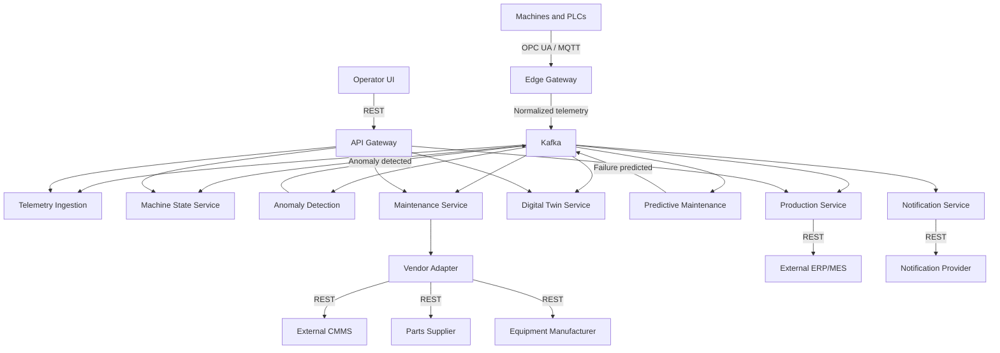

# Smart Factory Operations Example

## The factory

The example models a manufacturer that uses an in-house platform to operate CNC machines, robots, and assembly-line equipment. The platform runs as Kubernetes microservices and connects operational technology at the factory edge with enterprise and vendor systems.

Sensors continuously publish temperature, vibration, pressure, energy-consumption, and production-cycle measurements. The platform turns those signals into machine state, anomaly alerts, failure predictions, maintenance work orders, parts orders, operator notifications, and production-impact records.

All companies, teams, issue keys, endpoints, and measurements in this repository are fictional development data.

## Architecture story



The Edge Gateway owns the industrial protocol boundary. It accepts OPC UA value changes and MQTT messages, normalizes units, timestamps, quality, and asset identity, then publishes a canonical telemetry envelope to Kafka. Downstream services use the event backbone instead of connecting directly to equipment.

## In-house services

| Service | Responsibility | Primary interfaces |
| --- | --- | --- |
| API Gateway | Entry point for the operator UI and external clients | REST |
| Asset Registry | Stores factories, lines, machines, and sensors | REST, JDBC |
| Telemetry Ingestion | Validates and stores machine measurements | Kafka, REST, JDBC |
| Machine State Service | Calculates running, idle, warning, and stopped state | Kafka, REST, cache |
| Anomaly Detection | Detects abnormal vibration, temperature, and pressure | Kafka, REST |
| Predictive Maintenance | Estimates failure probability and remaining useful life | Kafka, REST |
| Maintenance Service | Creates and tracks maintenance work orders | Kafka, REST |
| Production Service | Tracks jobs, output, downtime, and rejected units | Kafka, REST, JDBC |
| Vendor Adapter | Isolates CMMS, supplier, and manufacturer APIs | REST |
| Notification Service | Alerts operators and maintenance teams | Kafka, REST |
| Digital Twin Service | Maintains the latest machine state | Kafka, REST, cache |

Kafka is modeled as the shared event platform. The example also includes a factory operations database, telemetry database, and machine-state cache as explicit infrastructure boundaries.

## External systems

- **ERP/MES simulator** provides production orders and receives downtime reports.
- **CMMS simulator** receives maintenance work orders.
- **Spare-parts supplier** returns price, availability, delivery date, and order confirmation.
- **Equipment manufacturer** supplies model-specific diagnostics.
- **Notification provider** simulates SMS, email, and Teams alerts.

## Operational lifecycle

1. A machine or PLC publishes an OPC UA value change, or a sensor publishes MQTT telemetry.
2. The Edge Gateway normalizes the signal and publishes it to Kafka.
3. Telemetry Ingestion persists the measurement while Machine State and Digital Twin update the current operational view.
4. Anomaly Detection evaluates abnormal signals. Predictive Maintenance combines anomalies, state, and diagnostics to estimate failure risk.
5. A failure prediction triggers the Maintenance Service to create a work order.
6. The Vendor Adapter registers the order in the CMMS and obtains parts or manufacturer diagnostics when required.
7. Notification Service alerts operators, and Production Service records the expected or actual downtime impact.

The architecture data records these paths as ordered data flows. Each step resolves to an interaction or internal module flow, so the canvas can select one step or the whole operational path without inventing links.

## Agile way of working

The fictional Factory Digital Platform programme uses Jira-style delivery records. Product, plant operations, industrial connectivity, platform, data science, reliability, security, and integration teams share one backlog while retaining clear ownership.

The example contains 66 work items, including 27 execution tasks, across three independent programme trees and up to five hierarchy levels:

- `FACTORY-100` delivers the core operations platform: edge telemetry, machine intelligence, maintenance automation, and operator/production workflows.
- `FACTORY-200` scales governed asset identity and replayable digital twins across plants.
- `FACTORY-300` hardens service reliability and governs production release readiness.
- Stories and tasks deliver protocol ingestion, Kafka contracts, anomaly models, asset synchronization, twin projection, CMMS integration, alert correlation, and release controls.
- Bugs capture observable defects such as duplicate work orders.
- Spikes record bounded replay and rollout investigations before delivery decisions.

Work items carry source-backed purpose, requirements, acceptance evidence, completion criteria, risks, open questions, ownership, estimates, relationships, comments, and provenance where relevant. `FACTORY-122` includes a complete example readiness assessment and discussion history for testing the Comments and AI Rating views.

The delivery hierarchy controls placement on the Agile Delivery canvas. Dependency, blocking, validation, defect, implementation, and related-work links remain semantic edges and do not distort parent-child levels.

## Delivery-to-architecture traceability

The cross-domain link set connects delivery records to the exact architecture boundary they affect. Examples include:

| Delivery record | Relationship | Architecture target |
| --- | --- | --- |
| `FACTORY-110` | scopes | Industrial Edge Gateway |
| `FACTORY-111` | implements | Edge Gateway / Telemetry Normalizer |
| `FACTORY-115` | implements | Kafka event platform |
| `FACTORY-122` | implements | Anomaly Detection / Anomaly Model |
| `FACTORY-124` | implements | Predictive Maintenance / Remaining-life Estimator |
| `FACTORY-133` | implements | Vendor Adapter / CMMS Client |
| `FACTORY-134` | required by | Maintenance Service / CMMS Adapter Client |
| `FACTORY-142` | implements | Production Service / Production-impact Calculator |
| `FACTORY-145` | implements | Notification Service / Provider Client |
| `FACTORY-211` | implements | Asset Registry / Asset Catalog |
| `FACTORY-221` | implements | Digital Twin Service / Twin Projector |
| `FACTORY-222` | implements | Digital Twin Service / Twin Cache |
| `FACTORY-311` | implements | Notification Service / Event Consumer |
| `FACTORY-312` | implements | Notification Service / Notification Policy |

The link set references existing records; it does not copy them. Architecture and Agile Delivery remain independently owned sources, and the unified view resolves their relationships at load time.

## Repository layout and verification

The complete development composition starts at [`resources/examples/unified-worldview.instance.json`](../resources/examples/unified-worldview.instance.json):

```text
resources/examples/
  architecture/            Architecture registry and per-system records
  agile-delivery/          Delivery registry and Jira-style work items
  cross-domain-links/      Explicit delivery-to-architecture assertions
  unified-worldview.instance.json
```

Open the repository folder in VS Code, run **Run FlowVerse with Smart Factory Example**, and then open the System Architecture, Agile Delivery, or Unified Worldview canvas. The example contract test validates schemas, registered references, hierarchy depth, architecture modules, cross-domain endpoints, and connector projection. The full test suite and both TypeScript checks provide the release gate.
